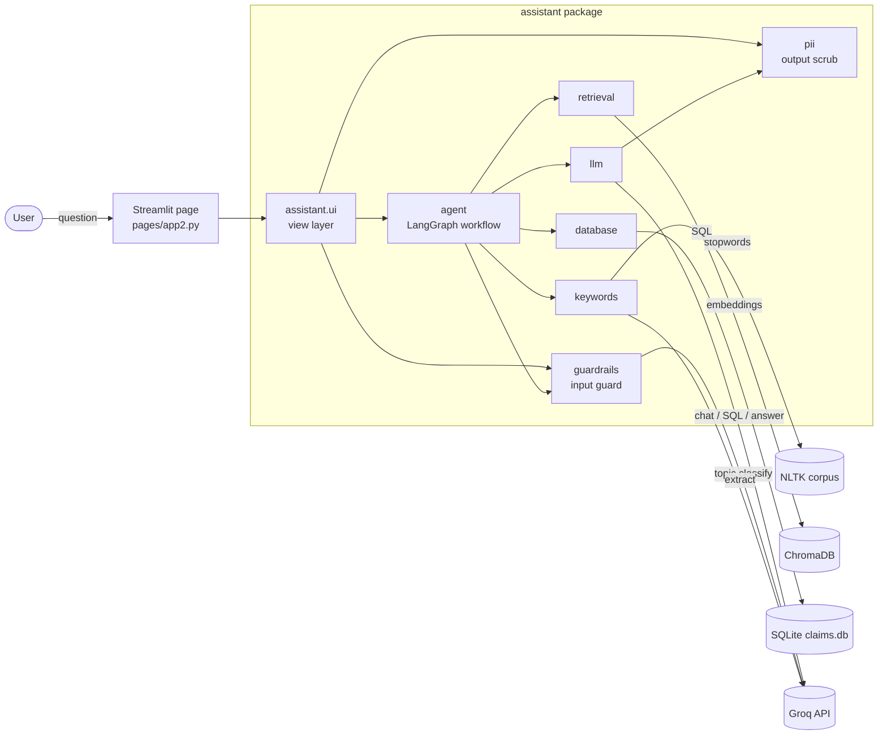
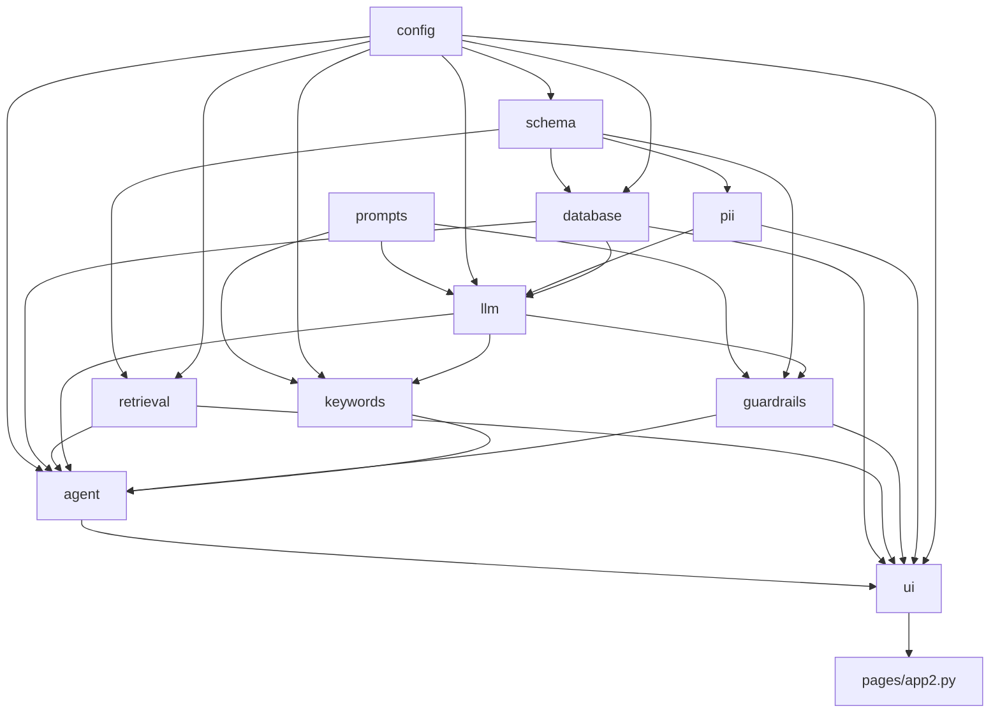
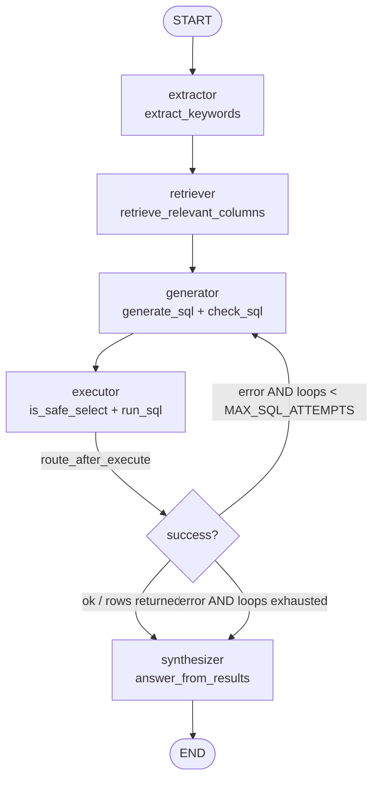
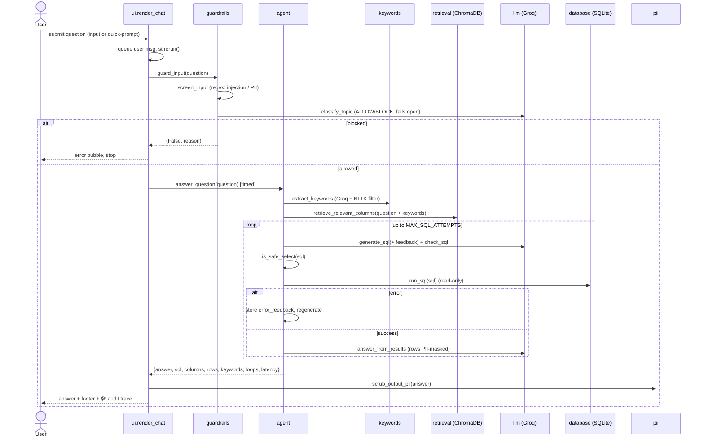

# Cotiviti Health Plan Ops Assistant — Architecture

A single-page Streamlit dashboard + RAG **text-to-SQL** chatbot over a synthetic
claims dataset. A user asks a question in natural language; a LangGraph agent
retrieves relevant columns, writes SQL, runs it against SQLite, self-corrects on
error, and summarizes the rows — wrapped in input/output safety guardrails.

- **LLM:** Groq `llama-3.3-70b-versatile`
- **Vector store:** ChromaDB (local MiniLM embeddings)
- **Data store:** SQLite (`claims.db`, seeded from synthetic data)
- **Orchestration:** LangGraph state machine with a bounded self-correction loop

---

## 1. System diagram (high level)



ASCII fallback:

```
 User
  │  question
  ▼
┌──────────────────────┐
│ Streamlit page app2  │  set_page_config → load data → render
└──────────┬───────────┘
           ▼
┌──────────────────────┐        ┌───────────────┐
│   assistant.ui       │───────▶│  Groq API     │◀── llm / guardrails / keywords
│  (view + controller) │        ├───────────────┤
└──────────┬───────────┘        │  ChromaDB     │◀── retrieval
           │                     ├───────────────┤
           ▼                     │  SQLite       │◀── database
┌──────────────────────┐        ├───────────────┤
│  agent (LangGraph)   │        │  NLTK corpus  │◀── keywords
└──────────────────────┘        └───────────────┘
```

---

## 2. Module dependency graph

Each module imports only from layers above it — no cycles.



| Layer | Module | Responsibility |
|------|--------|----------------|
| 1 | `config` | paths, model/table constants, API-key resolution |
| 1 | `prompts` | LLM prompt templates (leaf; no internal deps) |
| 2 | `schema` | `COLUMN_DOCS` (queryable) + `PII_COLUMNS` (protected) |
| 3 | `database` | synthetic data, SQLite seed/load, `run_sql`, `compute_kpis` |
| 3 | `retrieval` | ChromaDB schema vector store, `retrieve_relevant_columns` |
| 4 | `pii` | `mask_pii` (data) + `scrub_output_pii` (text) |
| 5 | `llm` | Groq client, `generate_sql`, `check_sql`, `answer_from_results` |
| 6 | `guardrails` | `is_safe_select` + input topic/safety guard |
| 6 | `keywords` | NLTK stop words + LLM keyword extraction |
| 7 | `agent` | LangGraph workflow, `answer_question` |
| 8 | `ui` | Streamlit header/sidebar/dashboard/chat |
| — | `pages/app2.py` | thin page that wires it all together |

---

## 3. LangGraph workflow (the agent)



- **Self-correction:** if `executor` hits an unsafe query or a SQL error, it stores
  `error_feedback` and the conditional edge routes back to `generator`, which
  regenerates *with that error injected*.
- **Bounded:** `loop_count` increments each `generator` pass; capped at
  `config.MAX_SQL_ATTEMPTS = 3` so it can never loop forever. On exhaustion the
  `synthesizer` emits a graceful "couldn't build a query" message.

State carried between nodes (`SQLAgentState`): `question, keywords, columns, sql,
sql_history, result_df, rows, error_feedback, loop_count, answer`.

---

## 4. Request lifecycle (sequence)



---

## 5. Detailed code flow (step by step)

**Startup (`pages/app2.py`)**
1. `st.set_page_config(...)` — must be the first Streamlit call.
2. `from assistant import config, ui` — importing `config` resolves the Groq key
   (`config.toml` → Streamlit secrets → `GROQ_API_KEY`).
3. `ui.inject_styles()` + `ui.render_header()`.
4. If `config.API_KEY` is missing → `ui.render_missing_key_error()` + `st.stop()`.
5. `df = load_claims()` — seeds `claims.db` from `generate_mock_data()` on first
   run (idempotent, cached), then reads it back.
6. Render `sidebar`, `dashboard` (left col), `chat` (right col), `footer`.

**Per question (`ui._process_pending_question`)**
7. A submitted question (typed or quick-prompt button) is appended to
   `st.session_state.messages` and triggers a rerun. The processor runs only when
   the last message is an unanswered user turn.
8. **Input guardrail** `guard_input(question)`:
   - `screen_input` — deterministic regex for prompt-injection/jailbreak and
     PII-seeking phrasing (free, instant).
   - `classify_topic` — 5-token Groq `ALLOW`/`BLOCK` topic check; **fails open**.
   - On block → error bubble, `st.rerun()`, pipeline skipped.
9. **Pipeline** `answer_question(question)` (wrapped in `time.perf_counter`):
   - `agent.get_sql_agent().invoke(initial_state)` runs the graph in §3.
   - **extractor** → `keywords.extract_keywords`: Groq pulls important terms;
     NLTK stop words filtered out.
   - **retriever** → `retrieval.retrieve_relevant_columns(question + keywords)`:
     ChromaDB returns the top-k most relevant columns.
   - **generator** → `llm.generate_sql` (temp 0) then `llm.check_sql` (LangChain
     refine pass over a PII-safe table).
   - **executor** → `guardrails.is_safe_select` (hard gate), then
     `database.run_sql` on a **read-only** connection; errors feed the retry loop.
   - **synthesizer** → `llm.answer_from_results`: rows are `pii.mask_pii`-ed
     before being sent to Groq; the model answers using only those rows.
10. **Output guardrail** `pii.scrub_output_pii(answer)` — redacts any SSN/email/
    phone pattern that slipped into the free text.
11. The assistant message (with `sql`, `columns`, `rows`, `keywords`, `loops`,
    `latency`) is appended and rendered: bubble + footer (`🗄️ answered from SQL ·
    N rows · ⏱️ Xs`) + **🛠️ Developer Audit Trace** expander.

**Error handling** — recoverable SQL errors are absorbed by the graph's retry
loop; genuine failures (auth, rate-limit, model) propagate and `ui._map_error`
turns them into friendly chat messages.

---

## 6. Defense-in-depth (where safety lives)

```
                 ┌───────────────────────── INPUT ─────────────────────────┐
question ──▶ screen_input (regex) ──▶ classify_topic (LLM, fail-open) ──▶ allowed
                 └──────────────────────────────────────────────────────────┘
                                          │
                 ┌──────────────────────── PIPELINE ───────────────────────┐
                 │ schema: PII columns absent from COLUMN_DOCS (never seen) │
                 │ is_safe_select: no DROP/INSERT/SELECT */PII/multi-stmt   │
                 │ run_sql: read-only SQLite connection (mode=ro)           │
                 │ mask_pii: rows masked before reaching the LLM            │
                 └──────────────────────────────────────────────────────────┘
                                          │
                 ┌──────────────────────── OUTPUT ─────────────────────────┐
answer ──────────▶ scrub_output_pii (redact SSN / email / phone) ──────────▶ user
                 └──────────────────────────────────────────────────────────┘
```

| Stage | Mechanism | Module |
|-------|-----------|--------|
| Before LLM | injection/PII/topic guard | `guardrails.guard_input` |
| SQL gen | PII columns never embedded | `schema` + `retrieval` |
| Pre-exec | read-only SELECT, no PII, single stmt | `guardrails.is_safe_select` |
| Exec | read-only DB connection | `database.run_sql` |
| Pre-summary | row PII masking | `pii.mask_pii` |
| Post-summary | free-text PII scrub | `pii.scrub_output_pii` |
